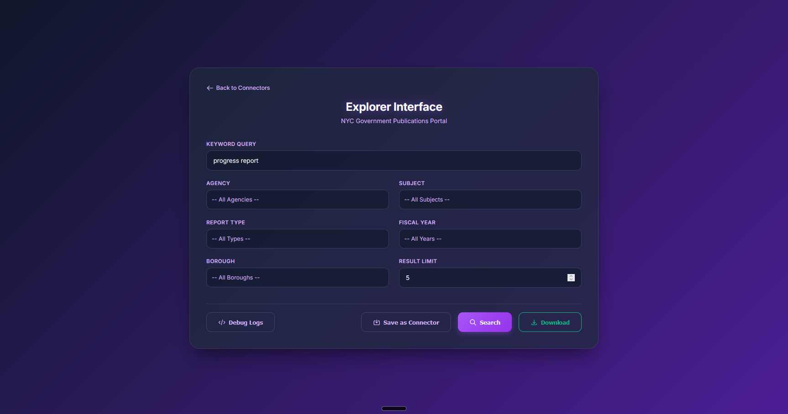

# NYC GPP Explorer

A modular, robust, and easy-to-use crawler and UI for the NYC Government Publications Portal (GPP).

## Features

- **Robust Akamai Bypass**: Uses `curl_cffi` to mimic browser fingerprints and handle rate limiting.
- **Modern Web UI**: A clean interface to search, filter, and download publications directly.
- **Modular Architecture**: Separate core library, CLI tools, and UI logic.
- **Portability**: Runs anywhere with relative pathing; easy to set up with `requirements.txt`.
- **Direct Download Proxy**: Stream files directly through the UI without manual navigation.

## Directory Structure

```text
NYC GPP/
├── core/               # Core logic (HyraxClient)
├── cli/                # Command line tools (search, download, bulk, filter parsing)
├── ui/                 # Web Interface (Dashboard + Connectors Portal)
├── config/             # Saved Connector profiles (connectors.json)
├── directives/         # SOP documentation
├── .env/               # Environment variables (synchronized dynamically by UI)
├── .tmp/               # Local temp data & downloads
└── start.py            # Main entry point (launches UI)
```



## Setup & Installation

The project requires **Python 3.8+**.

1. **Clone the Repository**:
   ```bash
   git clone [repository-url]
   cd "NYC GPP"
   ```

2. **Install Dependencies**:
   ```bash
   pip install -r requirements.txt
   ```
   *(Note: This project relies heavily on `curl_cffi` for handling Akamai Bot Manager constraints.)*

3. **Run the Dashboard Interface**:
   ```bash
   python start.py
   ```
   Then visit `http://localhost:8004` in your browser.

## The Connectors Architecture

This project includes a **Connectors System** which enables you to create and easily toggle between separate filtering contexts.

- Open `http://localhost:8004/` to view your Connectors dashboard.
- Create new connectors or "Save as Connector" from the Explorer interface.
- Clicking "Launch Explorer" on a Connector seamlessly injects its configuration parameters right into your local `.env` and routes you to the exploration workspace, keeping your CLI scripts and UI perfectly in sync.

## CLI Usage

### Searching
```bash
python cli/search.py --query "Veteran" --rows 10
```

### Downloading
```bash
python cli/download.py --id [WORK_ID]
```

## Technical Details

- **Layer 1 (Directive)**: SOPs in `directives/` define how the system works.
- **Layer 2 (Orchestration)**: CLI scripts and UI server manage the logic flow.
- **Layer 3 (Execution)**: `core/hyrax_client.py` handles the deterministic network operations.

## Contributing

This project is designed to be modular. If you want to add new search features, update `cli/search.py` and the UI template. If you want to update the scraping logic, modify `core/hyrax_client.py`.

---
*Developed as a modularized automation tool for NYC Government research.*
